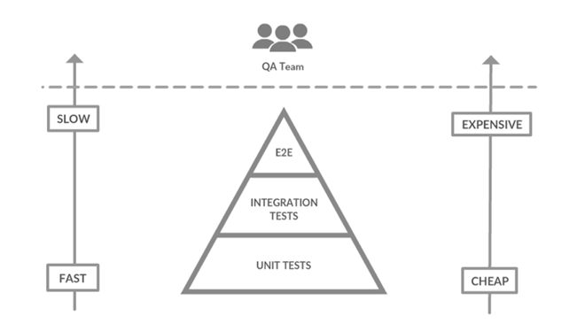
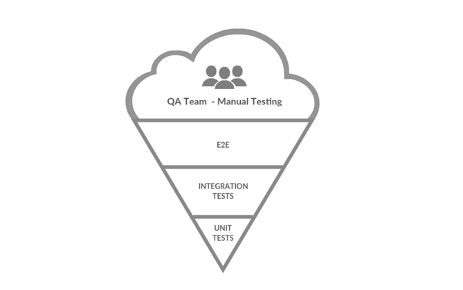
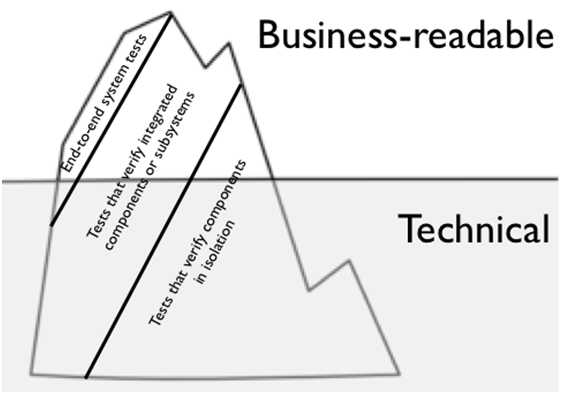

# Useful mindset for testing

Below are 4 different approaches that are useful when writing tests in software programs

* The testing pyramid 
* Anti-pattern: the inverted pyramid 
* Test coverage
* The Iceberg of testing

It is important to highlight that these focus points are not rules and are only a suggestion that is proposed to be taken into consideration when writing the tests.

## The testing pyramid

Given the existence of [different types of tests](./03.md), there is a structure popularly used to cover the distribution of these in a software project.

This structure takes into consideration the following variables to organize its distribution 
* execution speed 
* the cost of creation
* maintenance cost 

The unit test takes the majority of the pyramid because of its fast execution, ease of writing, and low cost of maintenance. The integration tests, even when are slower and more complex than unit tests, are cheaper than the end-to-end, and because of that those are in the middle part. Finally, benign the slower to execute and more expensive to create and maintain, there are the end-to-end tests, which are at the very top of the pyramid. 

## Anti-pattern: the inverted pyramid 

Although the testing pyramid is not a rule, we can speak of an anti-pattern when we find a project where the majority of the tests are manual and very few or non-existent automated tests.

This structure, because is based on manual tests rather than automated tests, is prone to human errors and indeterminism, making it more propensity to proliferation of errors in production and increase verification costs. 

## Test coverage

Frequently, with the intention of minimizing the probability of bugs as much as possible, the idea of 100% code coverage is pursued, however, the author highlights that this idea is not as good as it seems.

Let it not be misunderstood; When unit tests are implemented, the aim is to prove that the code has the expected behavior, but having 100% coverage is not a guarantee that there are no bugs in our code and the cost involved in achieving this percentage is greater than the benefit it returns.

There is no magic number that says what percentage is appropriate, since it is a decision that depends on the context, but focused on efficiency you can play with the granularity of the tests to have a balance between the reliability of the developed functionalities and the cost of test implementation.

## The Iceberg of testing

This approach proposes dividing the different tests into two categories
* Those readable by business experts
* Those that are not required to be readable by business experts

Regarding the tests that are required to be readable by business experts, its main proposal is to encourage communication, since these tests create a space where business logic and technical implementation converge. These types of tests are commonly called “acceptance tests” and can also serve as a program requirements document, having the particularity that said document is “alive” and reacts according to how the program behaves.

