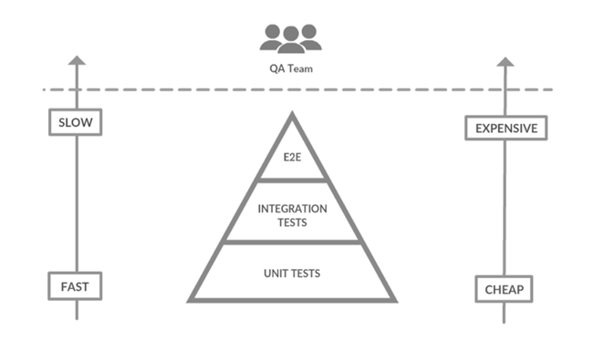
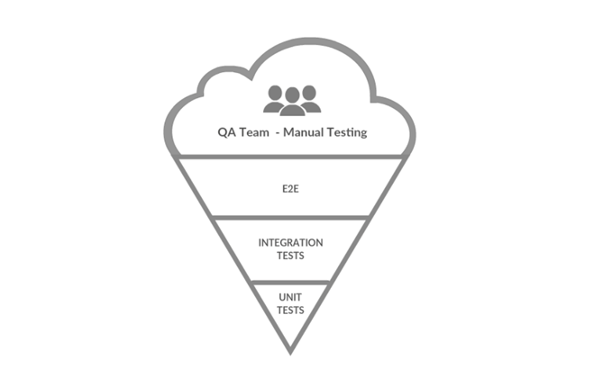
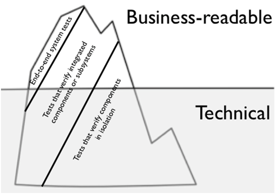

# Enfoques utiles para el testing

A continuación se presentan 4 diferentes enfoques que resultan útiles a la hora de escribir tests en programas de software
* La pirámide del testing
* Antipatrón: la pirámide invertida
* Test coverage
* Iceberg del testing

Es muy importante destacar que estos enfoques no son una regla y pretenden ser únicamente una sugerencia a considerar a la hora de hablar/escribir tests. 

## La pirámide del testing

Ante la existencia de [diferentes tipos de tests](./03.md), existe una estructura popularmente utilizada para abarcar la distribución de estos en un proyecto de software. 

Esta estructura contempla las siguientes variables para organizar su distribución. 
* la velocidad de ejecución
* el costo de creación
* el costo de mantenimiento 

Los test unitarios abarcan la mayoría de la pirámide debido a su rapidez de ejecución, facilidad de escritura y bajo costo de mantenimiento. Los tests de integración, aunque son más lentos y complejos que los test unitarios, son más baratos que los test end-to-end, por eso se encuentran en la parte media. Por último, en la cúspide de la pirámide, siendo los más lentos de ejecutar y costosos de crear y mantener debido a la implicación de todos los componentes del sistema, se tienen los tests end-to-end.  

## Antipatrón: La pirámide invertida  

A pesar de que la pirámide de los tests no es una regla, si podemos hablar de antipatrón cuando encontramos un proyecto en donde la mayoría de los tests son manuales y muy pocos o inexistentes tests automatizados.  

Esta estructura, debido a que se basa en pruebas manuales más que en pruebas automatizadas, está propensa al error humano y al indeterminismo, haciendo más factible la multiplicación de errores en producción y aumento de los costos de verificación.

## Test coverage

Con frecuencia, con la intención de minimizar al máximo la probabilidad de bugs, se persigue la idea de cobertura de un 100% en el código, sin embargo el autor destaca que esta idea no es tan buena como parece.

Que no se malentienda; cuando se implementan unit tests se busca probar que el código tenga el comportamiento esperado, pero tener el 100% de cobertura no es garantía de que no hayan bugs en nuestro código y el costo que implica alcanzar este porcentaje es mayor al beneficio que retorna. 

No hay un número mágico que diga que porcentaje es el adecuado, pues es una decisión que depende del contexto, pero enfocados en la eficiencia se puede jugar con la granularidad de las pruebas para tener un balance entre la fiabilidad en las funcionalidades desarrolladas y el costo de implementación de los tests.

## Iceberg del Testing

Este enfoque propone dividir los diferentes tests en dos categorías
* Las legibles por los expertos de negocio
* Las que no required ser legibles por los expertos de negocio

Sobre los test que se requieren legibles por los expertos del negocio, su principal propuesta es incentivar la comunicación, pues estos tests crean un espacio en donde la lógica del negocio y la implementación técnica convergen. Este tipo de tests son comúnmente llamados “test de aceptación” y pueden servir de igual manera de documento de requerimientos del programa, teniendo como particularidad que dicho documento está “vivo” y reacciona según el programa se comporte. 

